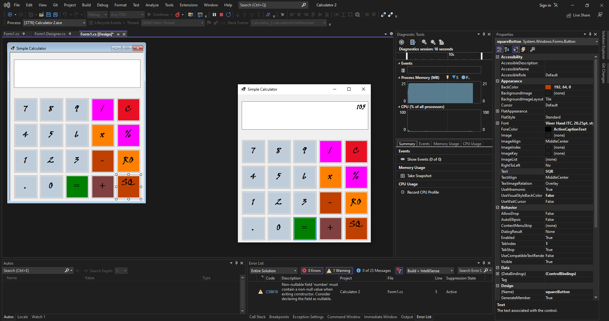

# Simple Calculator

## Description
This is a basic calculator application developed in C# using Visual Studio 2022. The calculator can perform addition, subtraction, division, multiplication, calculate square, square root, and percentages.

## Features
- Addition: Perform addition of two numbers.
- Subtraction: Perform subtraction of two numbers.
- Division: Perform division of two numbers.
- Multiplication: Perform multiplication of two numbers.
- Square: Calculate the square of a given number.
- Square Root: Calculate the square root of a given number.
- Percentages: Calculate the percentage of a given number.

## Installation
1. Clone the repository to your local machine using the following command: git clone https://github.com/rezaul-rimon/Simple-Calculator-usling-C-Sharp.git
2. Open the project in Visual Studio 2022.
3. Build the solution to restore the dependencies and compile the code.
4. Run the application to launch the Simple Calculator.

## Usage
1. Enter the first number in the appropriate input field.
2. Select the desired operation from the available options (addition, subtraction, etc.).
3. Enter the second number in the second input field.
4. Click on the "Calculate" button to perform the selected operation.
5. The result will be displayed in the output field.

## Contributing
Contributions are welcome! If you find any issues or have suggestions for improvements, please open an issue or submit a pull request. 

